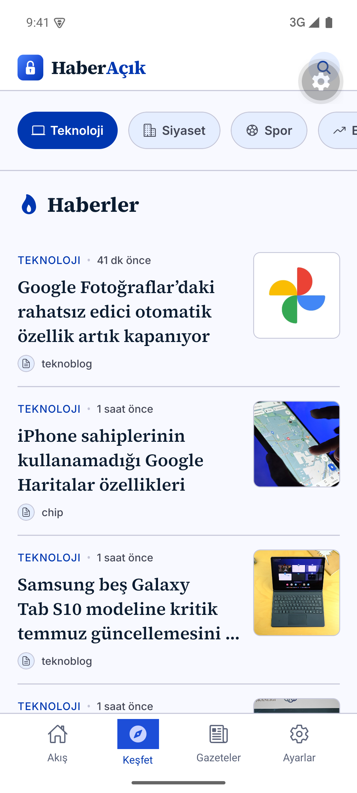
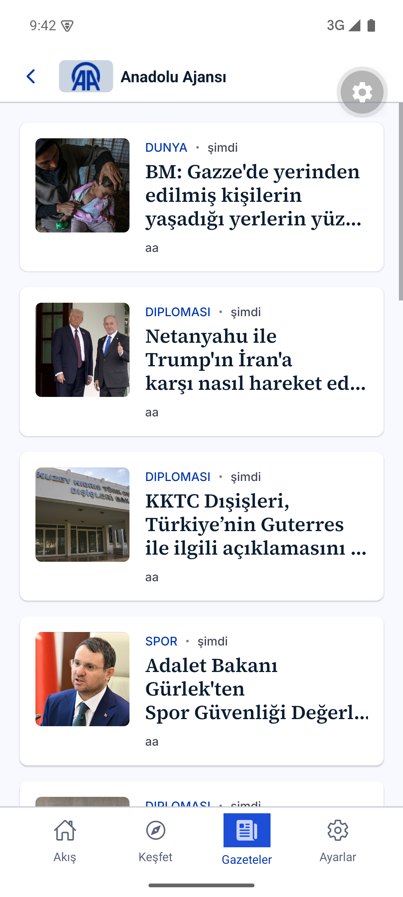
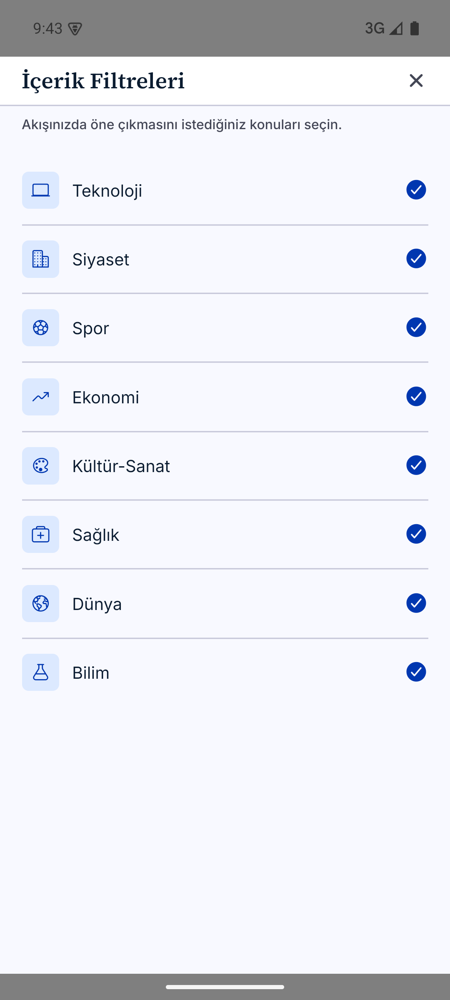

<div align="center">
  

  <h1>HaberAçık</h1>

  <p><strong>An open-source mobile news app that brings together different Turkish news sources in a single feed.</strong></p>

  <p>
    
    
    
    
    
  </p>
</div>

---

Built with Expo (React Native); runs on iOS and Android. News is collected from ~50 sources by a separate service, [news-crawler](https://github.com/canrollas/news-crawler), and written to a Supabase (Postgres) database — this app just reads and displays that data through an API.

## Table of contents

- [Features](#features)
- [Screenshots](#screenshots)
- [Tech stack](#tech-stack)
- [Project structure](#project-structure)
- [Development](#development)
- [Android release build & signing](#android-release-build--signing)
- [Notifications](#notifications)
- [Related repo](#related-repo)

## Features

| | |
|---|---|
| 🔵 **Personalize feed** | Home feed based on the sources and categories you follow. |
| 🔵 **Discover** | Browse news by category. |
| 🔵 **Sources** | Source list with per-source news feeds. |
| 🔵 **Breaking** | Push notifications via Firebase Cloud Messaging; stories covered by 2+ sources at the same time (i.e. genuinely trending) are sent through the `breaking_alerts` topic. |
| 🔵 **Custom** | Visual preferences are stored on-device. |
| 🔵 **Privacy** | No personal data is collected or stored on the device — preferences are kept locally only. |

## Screenshots

<div align="center">
  
  
  
  
</div>

## Tech stack

- [Expo](https://expo.dev) SDK 57 / React Native 0.86 / React 19 / TypeScript
- [`@react-native-firebase/messaging`](https://rnfirebase.io) — push notifications (modular API)
- `expo-notifications` — foreground local notification display, Android notification channel/icon
- `expo-splash-screen`, `expo-build-properties` — native build configuration
- Data source: Supabase Edge Function API (see `src/services/api.ts`)

## Project structure

```
src/
  screens/       Main screens (Feed, Discover, Newspapers, Settings, onboarding...)
  components/    Shared UI components (ArticleCard, BottomNavBar, modals...)
  context/       PreferencesContext (category/source/notification preferences + FCM topic sync)
  services/      api.ts (backend requests, timeout+retry), personalizedArticles.ts
  hooks/         usePushNotifications (permissions, foreground display, notification tap routing)
  data/          Static category definitions and backend category mapping
  theme/         Color/typography/spacing theme system
plugins/         Local Expo config plugins applied during native prebuild
  withReleaseSigning.js   Android release signing (see below)
```

## Development

```bash
npm install
npx expo start
```

Because it uses native modules (Firebase, notifications, etc.), it doesn't fully work in Expo Go — a development build is required:

```bash
npx expo run:ios
npx expo run:android
```

> [!NOTE]
> The `android/` and `ios/` folders are in `.gitignore` — they're generated automatically from the `app.json`/`plugins/` configuration via `expo prebuild`. If you need to change something on the native side, **don't edit the native files by hand** — add a config plugin to `app.json` instead, otherwise your changes will be lost on the next `expo prebuild --clean`.

## Android release build & signing

To produce a signed `.aab` ready for the Play Store:

```bash
npx expo prebuild --platform android --clean
cd android && ./gradlew bundleRelease
```

Output: `android/app/build/outputs/bundle/release/app-release.aab`

Signing relies on `release.jks` + `release.keystore.properties` files at the project root (never committed, gitignored). `plugins/withReleaseSigning.js` automatically picks these up on every `expo prebuild` and wires them into `android/app/build.gradle` — if the files are missing, the release build silently falls back to the debug keystore (fine for local development, but it can't be uploaded to the Play Store).

### CI/CD

`.github/workflows/android-release.yml`: on every push to `main` (or manual trigger), it prebuilds the native project, reconstructs `release.jks` and `google-services.json` from GitHub Secrets (`ANDROID_KEYSTORE_BASE64`, `ANDROID_KEYSTORE_ALIAS`, `ANDROID_KEYSTORE_PASSWORD`, `ANDROID_KEY_PASSWORD`, `GOOGLE_SERVICES_JSON_BASE64`), builds the signed `.aab`, and uploads it to the Actions run's **Artifacts** section. There's no automatic submission to the Play Store — the `.aab` is downloaded and uploaded to Play Console manually.

> [!IMPORTANT]
> `google-services.json` and `release.jks`/`release.keystore.properties` are gitignored and never committed — you need your own copies locally (from the Firebase console and your own release keystore) to build. CI reconstructs them from the secrets above.

## Notifications

- Following categories/sources → determines in-app feed content, doesn't currently trigger a separate push from the backend.
- `breaking_alerts` → a single global FCM topic all users are subscribed to; `trending_topics.py` in `news-crawler` finds stories covered by 4+ sources at the same time and pushes up to 3 of them to this topic per run.

## Related repo

News collection, enrichment (category/tag/summary via LLM), and notification triggering logic: [news-crawler](https://github.com/canrollas/news-crawler)

---

<div align="center">
  <sub>Released under the MIT license.</sub>
</div>
